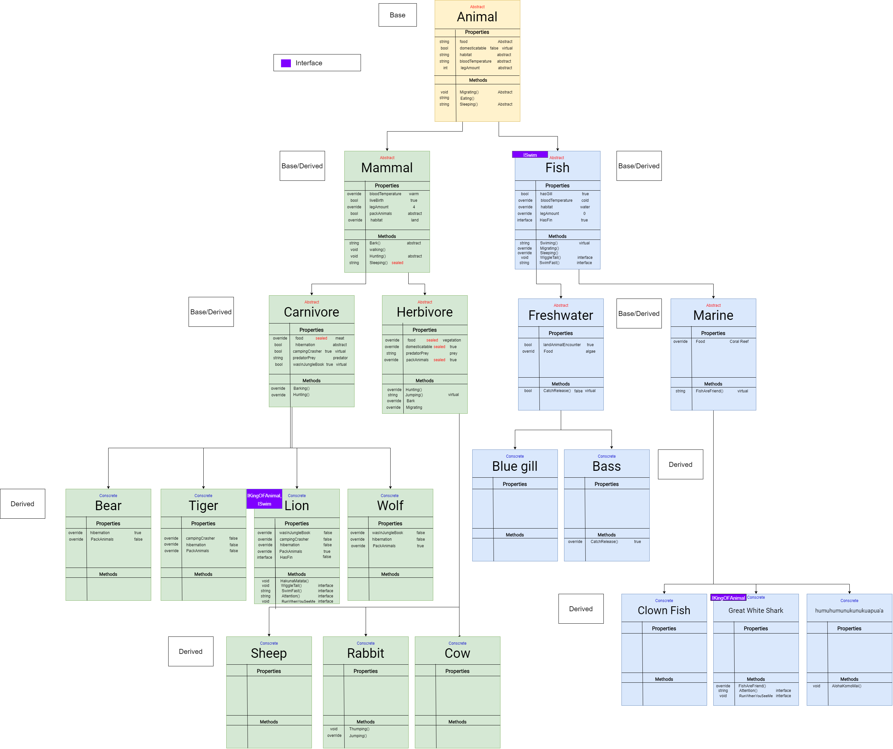
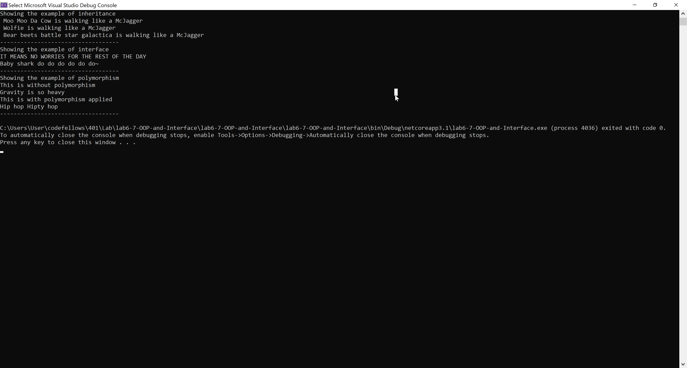

# ZooTopia

Lab 6, 7 - OOP and Interface

*Author: Jin Kim*

----

## Description

This is what you will find in the wild and the behaviors and any characteristics will be find in this classes and library.

---
## Dependencies

- [Git](https://git-scm.com/)
- Terminal/ Command line
- [.Net Core SDK](https://dotnet.microsoft.com/download)
- [Visual Studio](https://docs.microsoft.com/en-us/visualstudio/releases/2019/release-notes)

---
### Getting Started
Clone this repository to your local machine using terminal(macOS), command line(Window).

```
$ git clone https://github.com/jinwoov/lab6-7-OOP-and-Interface.git
```

### To run the program from Visual Studio:
Select ```File``` -> ```Open``` -> ```Project/Solution```

Next navigate to the location you cloned the Repository.

Double click on the ```lab6-7-OOP-and-Interface``` directory.

In the `lab6-7-OOP-and-Interface`, navigate further into `lab6-7-OOP-and-Interface`

Then select and open ```lab6-7-OOP-and-Interface.sln```

---
### Visuals

#### UML Diagram


#### Appliation Running


#### Unit Test


---

### OOP
OOP stands for object oriented program and it has four imperative component, includes, polymorphism, abstract, inheritance and interface. These components gives developer a powerful tool to dry the codes also create similarity to the parent and child classes. This linkage creates properties or method that is needed for particular classes and allows concrete classes share all these method thats been inherited by parent classes. The correct term for parent and child is `base` and `derived` classes. The downside of inheritance is that you can only inherit from one base and any changes you make can effect lineage following that parent. 

**Inheritance**: This concept is applied in my program by having wolf, cow and bear able to walk, which was given in `Mammal` class.  
**Polymorphism**: This is displayed through cow and rabbit. Herbivore, parent, has method for jumping which will return `Gravity is so heavy`, however with polymorphism, it will return `Hip hop Hipty hop`.  
**Encapsulation and Abstract**: I have abstract set for all of the parents above last lineage in the tree. Most of the methods are defined abstract and scope are set to public for all of the methods for program.cs and unit testing to have access to the animal classes.  
**Interface**: The example of interface is in the main method, but to elaborate. The `IKingOfAnimals` are implemented to `Lion` and `GreatWhiteShark` which they are stored in `IKingOfAnimals` array. Using the logic you can specify what class where it belongs to.  

---
### Interface 
Interface is a another way for you to inherit the behavior to the class and you can utilize its to group with other classes that took in inheritance from the parent class. Class that inherits interface must use methods that is in the interface. 

For this Application interface is applied in Lion and have lion implement methods that are in the `ISwim` and `IKingOfAnimals`. Since lion can't swim, `ISwim` is shown console with string different from great white shark. Great white shark has both interfaces applied as well but is inherited from `Fish`. This is true as great white shark can swim and is one of the notorious king of the marine animal. 

### Change Log
- 1.6: *Updated README and updated UML with Interface properties/methods* March 26 2020
- 1.5: *Created a method to display four pillars of OOP* March 26 2020
- 1.4: *Implemented interface to the classes and unit test displays pass* March 26 2020
- 1.3: *Link classes with inheritance and unit test passes* March 26 2020
- 1.2: *Revised existing UML to label base and derived classes* - March 26 2020
- 1.1: *Created library of animals in the classes* - March 25 2020  
- 1.0: *Created Repo, structuralized the application* - March 25 2020  