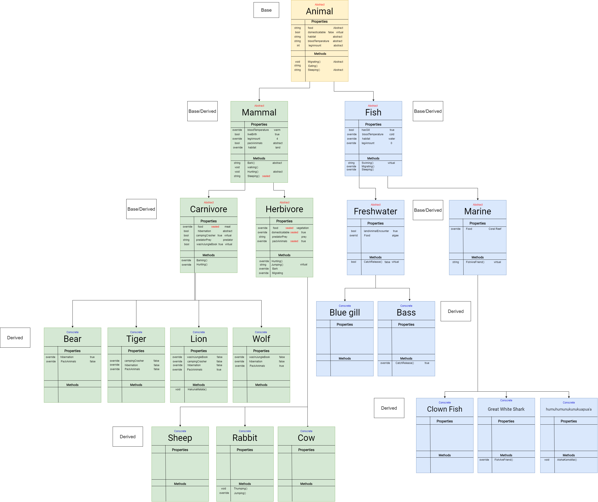
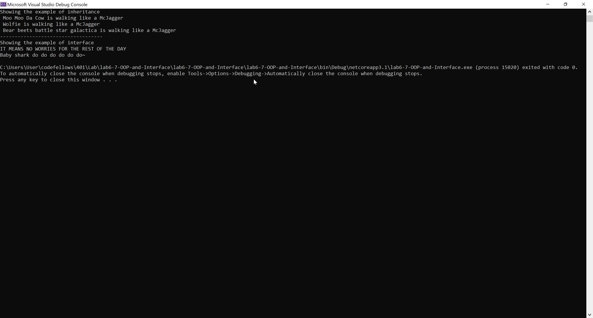
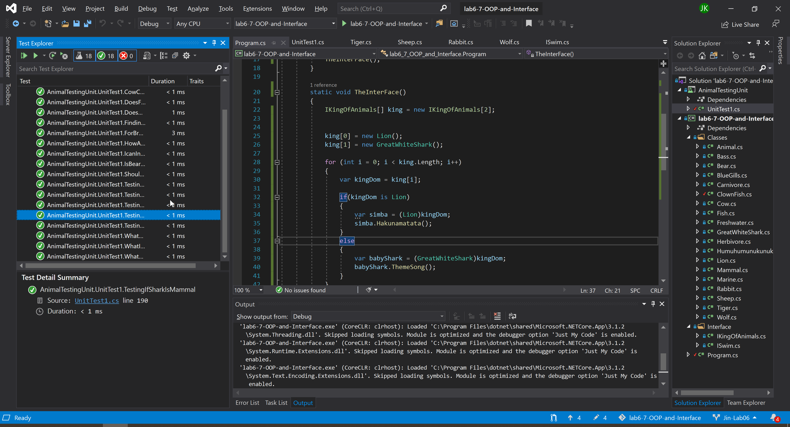

# ZooTopia

Lab6,7 - OOP and Interface

*Author: Jin Kim*

----

## Description

This is what you will find in the wild and the behaviors and any characteristics will be find in this classes and library.

---
## Dependencies

- [Git](https://git-scm.com/)
- Terminal/ Command line
- [.Net Core SDK](https://dotnet.microsoft.com/download)
- [Visual Studio](https://docs.microsoft.com/en-us/visualstudio/releases/2019/release-notes)

---
### Getting Started
Clone this repository to your local machine using terminal(macOS), command line(Window).

```
$ git clone https://github.com/jinwoov/lab6-7-OOP-and-Interface.git
```

### To run the program from Visual Studio:
Select ```File``` -> ```Open``` -> ```Project/Solution```

Next navigate to the location you cloned the Repository.

Double click on the ```lab6-7-OOP-and-Interface``` directory.

In the `lab6-7-OOP-and-Interface`, navigate further into `lab6-7-OOP-and-Interface`

Then select and open ```lab6-7-OOP-and-Interface.sln```

---
### Visuals

#### UML Diagram


#### Appliation Running


#### Unit Test


---

### Change Log
1.4: *Implemented interface to the classes and unit test displays pass* March 26 2020
1.3: *Link classes with inheritance and unit test passes* March 26 2020
1.2: *Revised existing UML to label base and derived classes* - March 26 2020
1.1: *Created libary of animals in the classes* - March 25 2020  
1.0: *Created Repo, structuralized the application* - March 25 2020  